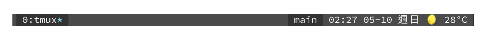

# 🌞🌛 Tmux-weather



Tmux-weather is a weather plugin for tmux. In the morning, it will simply show the weather condition. After sunset, the world becoming darker, but staying calm, if in a good weather condition, the moon is always be with you, and also on your status bar.

Motivation: [郭采潔 - 又圓了的月亮](https://www.youtube.com/watch?v=OfZfw3S_ZEk)

## Install with [tmux plugin manager - tpm](https://github.com/tmux-plugins/tpm)

0. The plugin script use `curl` , `nc`, `jq`, `awk`, and [tpm](https://github.com/tmux-plugins/tpm) make sure you have these tools.

1. Add the following line to `~/.tmux.conf`.

```bash
set -g @plugin 'timtorchen/tmux-weather'
```

2. Press `Prefix + I` to fetch the plugin.

## Configration

This plugin use [ipinfo.io](https://ipinfo.io/) and [OpenWeatherMap](https://openweathermap.org/) two services to get the weather by your ip address, if you do not configure them, you will get `🎃 lack-of-token`.

0. Regist two services and get the API tokens
1. After getting two tokens, put them into your startup file as enviromnent variable. If you are using bash as the default shell we suggest `~/.bashrc`, for zsh user `~/.zshrc` is suggested.

```bash
export IPINFO_TOKEN="your-ipinfo-token"
export OWM_TOKEN="your-OpenWeatherMap-token"
```

## Usage

Open `~/.tmux.conf` file, and add `#{weather}` tag anywhere you want to show the weather, for example:

```bash
set-option -g status-right "#{weather}"
```

## Customization

There are few customization options: update interval, location and temperature units. Add the options in your `~/.tmux.conf` if the default options do not meet your need.

```bash
# update interval is 15 minutes by default
set-option -g @tmux-weather-interval 15       

# use ip to get location by default
set-option -g @tmux-weather-location "Taipei" 

# set "c" for Celsius, and "f" for Fahrenheit. 
# default units is "c"
set-option -g @tmux-weather-units "c"         
```

## References

- [wego](https://github.com/schachmat/wego)
- [dstokes/tmux-weather](https://github.com/dstokes/tmux-weather)
- [xamut/tmux-weather](https://github.com/xamut/tmux-weather)
- [tmux plugin manager - tpm ](https://github.com/tmux-plugins/tpm)
